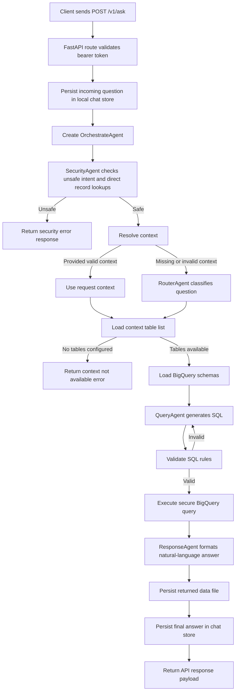
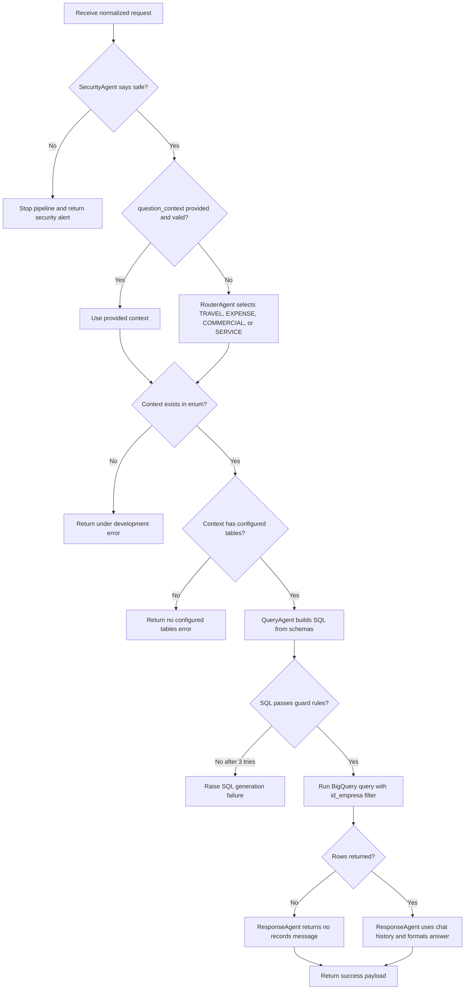

# Analytical Agent Backend

This folder contains the backend application for the Analytical Agent project.

It is a FastAPI service responsible for:
- serving the frontend shell and static assets used by the web UI
- authenticating the user with a bearer token
- orchestrating the multi-agent pipeline
- generating SQL, executing BigQuery queries, and formatting the final response
- persisting local chat history and saved response data files

## Folder Structure

- `src/`: backend source code
- `tests/`: backend tests organized to mirror the `src/` package structure
- `run.py`: local development entrypoint
- `venv/`: Python virtual environment for the backend
- `storage/`: saved response payloads
- `chat_messages.json`: local chat history store
- `pipeline_logs.log`: backend log file
- `.env`: local environment variables
- `requirements.txt`: Python dependencies for the backend environment

## Requirements

- Python 3.12+
- A valid `.env` file in this folder
- The Google service-account file referenced by `PROJECT_SA`

Expected `.env` variables:

```env
GEN_IA_KEY=your_llm_api_key
PROJECT=your_gcp_project_id
PROJECT_SA=your-service-account-file.json
APP_HOST=127.0.0.1
APP_PORT=8000
APP_LOGIN_PASSWORD=your_shared_login_password
PRIVILEGED_LOG_VIEWER_EMAILS=manuueelneto@gmail.com,user@example.com
```

## Local Setup

From the repository root:

```bash
cd backend
python3 -m venv venv
source venv/bin/activate
python -m pip install --upgrade pip
python -m pip install -r requirements.txt
```

If `requirements.txt` is out of date in your environment, install the backend runtime packages directly:

```bash
python -m pip install fastapi uvicorn python-dotenv pydantic email-validator google-cloud-bigquery langchain-community langchain-core langchain-google-genai
```

## Run The Server

From `backend/`:

```bash
source venv/bin/activate
python run.py
```

The backend starts a local Uvicorn server and serves:
- API docs on `http://127.0.0.1:8000/docs`
- ReDoc on `http://127.0.0.1:8000/redoc`
- Frontend shell on `http://127.0.0.1:8000/`

## Run The Tests

From `backend/`:

```bash
venv/bin/python -m unittest discover -s tests
```

This command runs the backend test suite using the local virtual environment.

Current test layout mirrors the backend package structure:
- `tests/agents/`: tests for `src/agents/`
- `tests/api/`: tests for `src/api/`
- `tests/api/routes/`: tests for `src/api/routes/`
- `tests/main/`: tests for `src/main/`

## Swagger Documentation

The backend uses FastAPI's built-in Swagger UI.

Main documented endpoints:
- `POST /v1/login`: returns a bearer token
- `GET /v1/session`: validates the bearer token
- `POST /v1/ask`: runs the full agent pipeline

Static HTML routes such as `/` and `/login` are intentionally hidden from the OpenAPI schema so the docs stay focused on the backend API.

### Authentication In Swagger

The current API expects the token in the `Authorization` header using the format:

```text
Bearer <token>
```

Example workflow:
1. Call `POST /v1/login` with an email and password.
2. Copy the returned `access_token`.
3. Use it in `GET /v1/session`, `POST /v1/ask`, and `GET /v1/runtime-logs` as `Authorization: Bearer <token>`.

## Process Flow

The backend request flow for `POST /v1/ask` is:



## Multi-Agent Decision Logic

This is the decision path inside the orchestrator:



Decision summary:
- `SecurityAgent` is the first gate and can stop the request immediately when it detects injection, malicious intent, or direct identifier-based record lookups.
- `RouterAgent` only runs when `question_context` is missing or invalid.
- `QueryAgent` retries SQL generation up to 3 times until the SQL passes the local validation rules.
- `ResponseAgent` always formats the final response, but returns a fixed fallback message when the query returns no rows.
- Users whose email is listed in `PRIVILEGED_LOG_VIEWER_EMAILS` can see the live runtime log panel in the right-side UI column.

Blocked prompt example:
- `Give me data from user with id = 20`

## Example Requests

### Login

```json
{
  "email": "user@example.com",
  "password": "demo_password"
}
```

### Ask The Agent

```json
{
  "email": "user@example.com",
  "question": "How much did my travel expenses cost this month?",
  "chat_id": "chat_demo_001",
  "question_id": "question_demo_001",
  "response_type": "TEXT",
  "question_context": "TRAVEL"
}
```

## Notes

- `chat_messages.json` is the canonical chat-history file and must stay inside `backend/`.
- `storage/` contains generated data files returned by the agent pipeline.
- `pipeline_logs.log` records backend activity for local troubleshooting.
- FastAPI routes are registered explicitly in the route modules, and the test suite covers the agent flow, API modules, and orchestrator behavior.

## Troubleshooting

If the server fails to start:
- confirm the virtual environment is active with `which python`
- confirm the path points to `backend/venv/bin/python`
- verify that `uvicorn` is installed in the backend virtual environment
- verify `.env` points to a valid Google service-account file inside `backend/`
