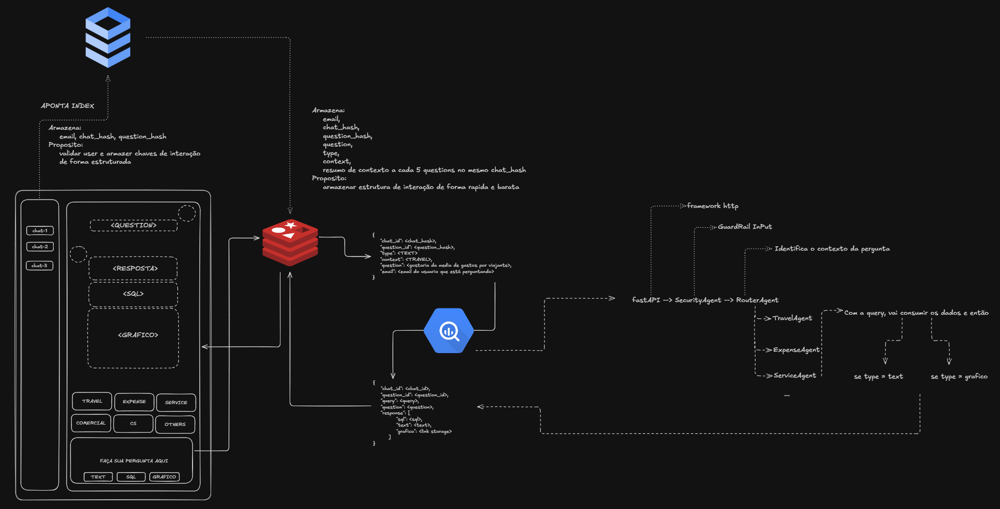

# AI SQL Agent: BigQuery + Gemini

This project is an artificial intelligence agent designed to translate natural language questions into specific **Google BigQuery** SQL queries. The core differentiator of this agent is the **Security Wrapper** layer, which ensures that a user can never access data belonging to a company other than their own.

## 🗄️ 1. Database Preparation (Mocked Data)

The database simulates a travel management system. The script below prepares the environment in BigQuery within the `test_ia` dataset.

### Table Structure
* **`users`**: Stores name, email, and `company_id` (the link to the organization).
* **`passagens_aereas`**: Stores flight protocols, dates, and prices, also linked to a `company_id`.

[Image of a database schema showing a one-to-many relationship between users and passagens_aereas via company_id]

### Setup Script (SQL)
Run the code below in the BigQuery console to generate the test data (51 users and 201 flight records):

```.env
GEN_IA_KEY=<YOUR IA STUDIO KEY>
PROJECT=<YOUR PROJECT>
PROJECT_SA=<YOUR SERVICE ACCOUNT KEY FROM GCP>
```

```project-tree
├── src
│   ├── agents
│   │   ├── __init__.py
│   │   └── query_agent.py
│   ├── api
│   │   ├── __init__.py
│   │   └── app.py
│   ├── infra
│   │   ├── config
│   │   │   ├── config_google
│   │   │   │   ├── __init__.py
│   │   │   │   └── bigquery_maganger.py
│   │   │   └── __init__.py
│   │   └── __init__.py
│   ├── main
│   │   ├── __init__.py
│   │   └── main.py
│   └── __init__.py
├── .gitignore
├── readme.md
├── run.py
└── schema_project.png
```


```sql
-- Schema Creation
CREATE OR REPLACE TABLE `test_ia.users` (
    id INT64,
    name STRING,
    email STRING,
    company_id INT64
);

INSERT INTO `test_ia.users` (id, name, email, company_id)
WITH first_names AS (
    SELECT ARRAY<STRING>[
        'Ana','Bruno','Carla','Daniel','Eduardo','Fernanda','Gabriel','Helena','Igor','Juliana',
        'Kleber','Larissa','Marcos','Natalia','Otavio','Patricia','Rafael','Sabrina','Tiago','Vanessa',
        'William','Yasmin','Beatriz','Caio','Debora','Fabio','Giovana','Hugo','Isabela','Joao',
        'Karen','Leandro','Mariana','Nicolas','Paula','Renato','Sara','Vitor','Wesley','Aline',
        'Cintia','Diego','Elaine','Felipe','Gustavo','Livia','Mateus','Priscila','Rodrigo','Tatiane'
    ] AS arr
),
last_names AS (
    SELECT ARRAY<STRING>[
      'Silva','Souza','Oliveira','Santos','Pereira','Lima','Carvalho','Ribeiro','Almeida','Gomes',
      'Martins','Ferreira','Rodrigues','Barbosa','Teixeira','Moura','Araujo','Monteiro'
    ] AS arr
),
base AS (
    SELECT id FROM UNNEST(GENERATE_ARRAY(1, 50)) AS id
)
SELECT
    base.id,
    CONCAT(
        (SELECT arr[OFFSET(MOD(base.id - 1, ARRAY_LENGTH(arr)))] FROM first_names),
        ' ',
        (SELECT arr[OFFSET(MOD(base.id * 3, ARRAY_LENGTH(arr)))] FROM last_names)
    ) AS name,
    FORMAT('user%03d@company.com', base.id) AS email,
    1001 + MOD(base.id - 1, 8) AS company_id
FROM base
UNION ALL
SELECT 6666, 'Manuel Ventura', 'manuueelneto@gmail.com', 1;

-- =========================================================
-- 2) TABLE: AIR_TICKETS
-- =========================================================
CREATE OR REPLACE TABLE `test_ia.air_tickets` (
    id INT64,
    ticket STRING,
    company_id INT64,
    departure_date DATE,
    arrival_date DATE,
    departure_amount NUMERIC,
    arrival_amount NUMERIC
);

INSERT INTO `test_ia.air_tickets`
    (id, ticket, company_id, departure_date, arrival_date, departure_amount, arrival_amount)
WITH base AS (
    SELECT id FROM UNNEST(GENERATE_ARRAY(1, 200)) AS id
),
dates AS (
    SELECT 
        id, 
        DATE_ADD(DATE '2026-01-01', INTERVAL id DAY) AS departure_date
    FROM base
)
SELECT
    dates.id,
    FORMAT('CODE-%s-%06d', FORMAT_DATE('%Y%m', dates.departure_date), dates.id) AS ticket,
    1001 + MOD(dates.id - 1, 8) AS company_id,
    dates.departure_date,
    DATE_ADD(dates.departure_date, INTERVAL (2 + MOD(dates.id, 14)) DAY) AS arrival_date,
    (CAST(150 + MOD(dates.id * 97, 2200) AS NUMERIC)
        + (CAST(MOD(dates.id * 13, 100) AS NUMERIC) / 100)) AS departure_amount,
    (CAST(150 + MOD(dates.id * 131, 2400) AS NUMERIC)
        + (CAST(MOD(dates.id * 29, 100) AS NUMERIC) / 100)) AS arrival_amount
FROM dates
UNION ALL
SELECT 666, 'CODE-202602-000666', 1, DATE '2025-12-31', DATE '2026-12-31', 666.66, 1001.00;

-- =========================================================
-- 3) TABLE: COMPANIES
-- =========================================================
CREATE OR REPLACE TABLE `test_ia.companies` (
  company_id INT64,
  company_name STRING,
  company_hash STRING
);

INSERT INTO `test_ia.companies` (company_id, company_name, company_hash)
SELECT 1,    'Manuel Company', TO_HEX(SHA256(CAST('owner_manual' AS BYTES))) UNION ALL
SELECT 1001, 'Company 1001',   TO_HEX(SHA256(CAST('owner_a' AS BYTES)))      UNION ALL
SELECT 1002, 'Company 1002',   TO_HEX(SHA256(CAST('owner_a' AS BYTES)))      UNION ALL
SELECT 1003, 'Company 1003',   TO_HEX(SHA256(CAST('owner_b' AS BYTES)))      UNION ALL
SELECT 1004, 'Company 1004',   TO_HEX(SHA256(CAST('owner_c' AS BYTES)))      UNION ALL
SELECT 1005, 'Company 1005',   TO_HEX(SHA256(CAST('owner_c' AS BYTES)))      UNION ALL
SELECT 1006, 'Company 1006',   TO_HEX(SHA256(CAST('owner_c' AS BYTES)))      UNION ALL
SELECT 1007, 'Company 1007',   TO_HEX(SHA256(CAST('owner_d' AS BYTES)))      UNION ALL
SELECT 1008, 'Company 1008',   TO_HEX(SHA256(CAST('owner_d' AS BYTES)));

-- =========================================================
-- 4) TABLE: EXPENSES
-- =========================================================
CREATE OR REPLACE TABLE `test_ia.expenses` (
  id INT64,
  user_id INT64,
  company_id INT64,
  expense_date DATE,
  category STRING,
  description STRING,
  amount NUMERIC,
  status STRING,
  ticket STRING
);

INSERT INTO `test_ia.expenses`
    (id, user_id, company_id, expense_date, category, description, amount, status, ticket)
WITH categories AS (
    SELECT ARRAY<STRING>[
        'Food',
        'Gasoline',
        'Hotel',
        'Transport',
        'Air Ticket',
        'Uber',
        'Reimbursement'
    ] AS arr
),
status_arr AS (
    SELECT ARRAY<STRING>['APPROVED','PENDING','REJECTED'] AS arr
),
base AS (
    SELECT id FROM UNNEST(GENERATE_ARRAY(1, 500)) AS id
),
base_enriched AS (
    SELECT
        base.id,
        CASE WHEN MOD(base.id, 40) = 0 THEN 6666 ELSE (1 + MOD(base.id - 1, 50)) END AS user_id,
        CASE WHEN MOD(base.id, 40) = 0 THEN 1 ELSE (1001 + MOD(base.id - 1, 8)) END AS company_id,
        DATE_ADD(DATE '2026-01-01', INTERVAL MOD(base.id * 7, 180) DAY) AS expense_date,
        (SELECT arr[OFFSET(MOD(base.id - 1, ARRAY_LENGTH(arr)))] FROM categories) AS category,
        (SELECT arr[OFFSET(MOD(base.id - 1, ARRAY_LENGTH(arr)))] FROM status_arr) AS status
    FROM base
)
SELECT
    be.id,
    be.user_id,
    be.company_id,
    be.expense_date,
    be.category,
    CONCAT('Expense ', be.category, ' #', CAST(be.id AS STRING)) AS description,
    (CAST(20 + MOD(be.id * 37, 1500) AS NUMERIC)
        + (CAST(MOD(be.id * 19, 100) AS NUMERIC) / 100)) AS amount,
    be.status,
    IF(be.category = 'Air Ticket', ati.ticket, NULL) AS ticket
FROM base_enriched be
LEFT JOIN `test_ia.air_tickets` ati
    ON ati.id = 1 + MOD(be.id - 1, 200)
    AND ati.company_id = be.company_id

UNION ALL

SELECT
    999999,
    6666,
    1,
    DATE '2026-01-15',
    'Food',
    'Dinner with client',
    189.90,
    'APPROVED',
    NULL
;
```


## Schema of the project

